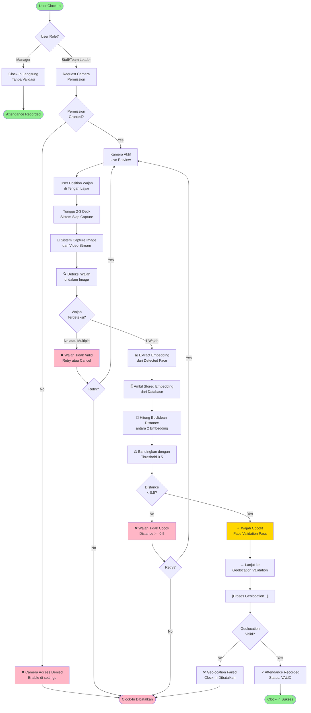

# Face Recognition - Flowchart Lengkap

## Penjelasan Flow:

1. **Start**: User membuka halaman clock-in
2. **Role Check**: Tentukan apakah staff/team leader atau manager
3. **Camera Permission**: Request akses camera ke browser
4. **Capture**: Ambil snapshot wajah dari video stream
5. **Detect**: Cari dan validasi ada 1 wajah di image
6. **Extract**: Konversi wajah menjadi embedding (128 angka)
7. **Compare**: Hitung jarak dengan embedding yang tersimpan
8. **Validate**: Cek apakah distance < 0.5
9. **Pass/Fail**: Jika pass → geolocation, jika fail → retry atau abort
10. **Geolocation**: Proses validasi lokasi (file terpisah)
11. **Result**: Attendance recorded atau clock-in dibatalkan
