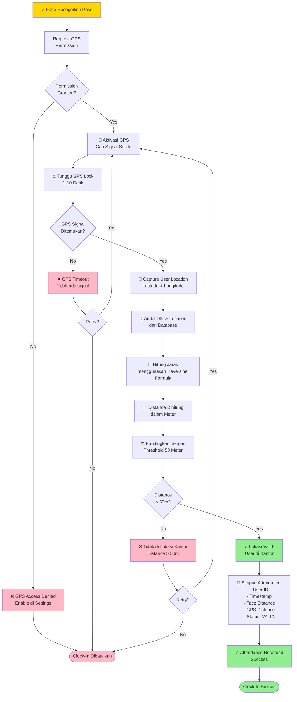

# Geolocation - Flowchart Lengkap



## Penjelasan Flow:

1. **Start**: Setelah face recognition pass, lanjut ke geolocation
2. **GPS Permission**: Request akses GPS ke device/browser
3. **GPS Activation**: Nyalakan GPS dan tunggu signal satelit
4. **Capture Location**: Ambil koordinat lokasi user saat ini (Lat/Long)
5. **Get Office Location**: Ambil koordinat kantor dari database
6. **Calculate Distance**: Gunakan Haversine formula untuk hitung jarak
7. **Validate**: Cek apakah distance <= 50 meter
8. **Pass/Fail**: Jika pass → simpan attendance, jika fail → retry atau abort
9. **Record**: Simpan attendance dengan status VALID
10. **Result**: Clock-in sukses atau dibatalkan

---

## Threshold & Metrics:

| Metric | Threshold | Keterangan |
|--------|-----------|-----------|
| **Distance** | ≤ 50 meter | Radius kantor |
| **GPS Accuracy** | ±5-50 meter | Tergantung kondisi |
| **GPS Timeout** | 10 detik | Max tunggu signal |
| **User Location** | Outdoor > Indoor | GPS lebih akurat outdoor |

---

## Skenario:

### Scenario 1: User di Kantor (Valid)
```
GPS Permission ✓ → GPS Lock 5 detik → 
User: (-6.1750, 106.8272) → 
Office: (-6.1753, 106.8271) → 
Distance: 38m → 38m ≤ 50m → ✓ PASS
```

### Scenario 2: User di Rumah (Invalid)
```
GPS Permission ✓ → GPS Lock 3 detik → 
User: (-6.2000, 106.7000) → 
Office: (-6.1753, 106.8271) → 
Distance: 15.2km → 15.2km > 50m → ❌ FAIL
```

### Scenario 3: GPS Signal Lemah (Error)
```
GPS Permission ✓ → Cari signal 10 detik → 
Timeout / Signal tidak ditemukan → 
❌ GPS TIMEOUT → Retry atau Cancel
```
